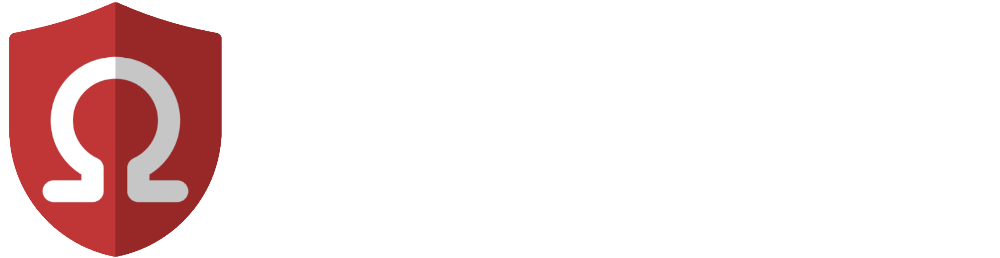

  

Omega moderation bot.

## Specifications

 - [ ] Relational Database
 - [ ] Message actions
   - [ ] Moderate: Allows to select a rule, a sanction and add a comment. When used, the bot will DM the person who posted the selected message, add an entry in the database, log the sanction in the log channel and execute the sanction.
   - [ ] Report to moderation: Available to everyone. Allows to select a rule and add a comment. When used, the bot will add an entry in the database, and log the report in the reports channels.
 - [ ] User actions
   - [ ] Moderate: Allows to select a rule, a sanction and add a comment. When used, the bot will DM the person who posted the selected message, add an entry in the database, log the sanction in the log channel and execute the sanction.
 - [ ] Role selector

## License and copyright

Omega-Modbot is free software: you can redistribute it and/or modify it under the terms of the [GNU General Public License](LICENSE.md) as published by the Free Software Foundation, either version 3 of the License, or (at your option) any later version.

Omega-Modbot is distributed in the hope that it will be useful, but WITHOUT ANY WARRANTY; without even the implied warranty of MERCHANTABILITY or FITNESS FOR A PARTICULAR PURPOSE.  See the GNU General Public License for more details.

You should have received a copy of the GNU General Public License along with Omega-Modbot. If not, see <https://www.gnu.org/licenses/>.
